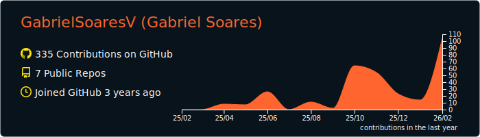
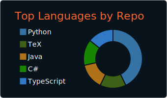
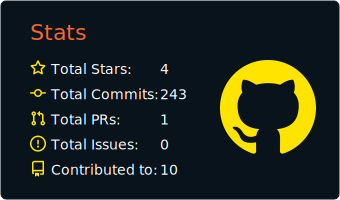

  

# Sobre mim:
Olá, desenvolvedores, recrutadores, entusiastas e estudantes de
tecnologia!\
Sou Gabriel, desenvolvedor Java Backend.

Acredito que a tecnologia deve simplificar a vida, liberando tempo para
o que realmente importa. Por isso, otimizo processos complexos em ONGs, escolas/faculdades e organizações de apoio social, transformando fluxos manuais e burocráticos em sistemas organizados e escaláveis.

Estou sempre em busca de novos desafios e aprendizados para continuar
evoluindo técnica e estrategicamente.

# Tech Stack:

  

  

  

  

  

  

  

  

  

  

  

  

  

  

  

 
 

# GitHub Stats: 

## GitHub Trophies

### Random Dev Quote

### Top Contributed Repo

---

#### Contatos:

